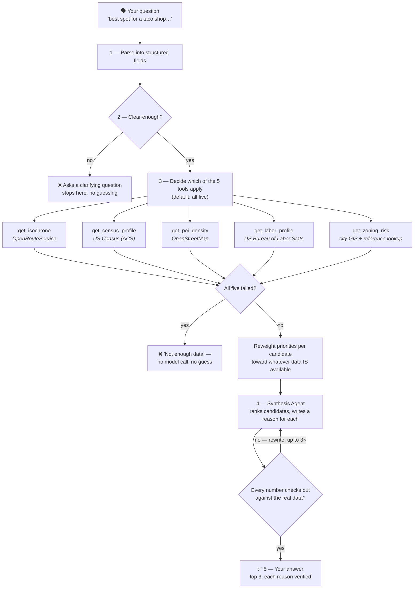

# Site Selection Copilot

You ask it something like *"best spot for a fast-casual restaurant near East Austin, budget-conscious"* — it looks up real data about a handful of candidate addresses (how easy they are to reach, who lives nearby, how many competitors are already there, what it costs to staff the place, and how risky the zoning is), then writes you a ranked top-3 with a plain-English reason for each pick. Every number in that reason is checked against the real data before you see it — if it can't be verified, it gets pulled rather than shown.

There's a web UI now (`streamlit run app.py`), and it can onboard a brand-new city on request — just tell it the name and it goes and gets the map data itself. Ask it about a city it doesn't fully know yet (say, one with no zoning data) and it adjusts its confidence honestly instead of guessing or refusing.

**Don't have addresses in mind yet?** Name a city and it will suggest a starting set — real, currently-mapped commercial addresses spread across that city, each labelled with its neighborhood. Nothing is invented: the suggestions come from actual businesses mapped in OpenStreetMap, filtered to the city's real administrative boundary (a bounding box around Manhattan also covers Hoboken and Brooklyn, so a box isn't good enough), and spatially binned so you get Battery Park *and* Harlem rather than five addresses clustered downtown.

## How it works



Walking through it:

1. **Parse.** Your sentence becomes structured data — business type, what you care about most, any hard limits (like "needs a drive-thru"). A follow-up that only mentions new priorities still remembers the rest from your last question.
2. **Clear enough?** Before spending a single API call, it checks whether it actually understood you. Ask it to site a store selling "nostalgia and vibes" and it stops here and asks what you mean.
3. **Decide which tools apply.** All five, by default. It only skips one with a stated reason — e.g. an unstaffed vending kiosk correctly skips `get_labor_profile`, since there's no staff to price.
4. **Five tools, five real APIs.** Every box above is a live call to a public data source, not a model guessing what the data probably looks like. A failed call reports `status: failed` honestly instead of quietly returning something plausible-looking.
5. **Reweight, then synthesize.** If a candidate is missing a data point (say, this city has no zoning coverage), that slice of its priority weight doesn't just vanish — it's redistributed proportionally onto the dimensions that *do* have data for that candidate, and the model is told to score against that adjusted split. One model call then ranks the candidates and writes a reason for each.
6. **Fact-check itself.** A separate, non-negotiable check confirms every number in each reason actually appears in the source data. If it finds one that was made up, it sends it back to be rewritten (up to 3 times), and shows "manual review needed" rather than a shaky sentence if it's still not clean.

**Two exits matter as much as the happy path.** If the question doesn't make sense, it asks instead of guessing. If every data source fails, it says "not enough data" — without even calling the model — instead of ranking on nothing. Both are tested, not hypothetical.

**Real bugs this process has caught, along the way:** an automated grader's own written explanation once referenced a candidate that wasn't in the data it was given — the *score* it landed on was still right, but its self-explanation wasn't fully faithful, a good reminder to spot-check even the checker. Testing a Manhattan address surfaced that its income was being compared against *Austin's* median by default (a hardcoded leftover) — now that comparison is derived live from whichever city the address is actually in, for any US location, no hardcoding needed. And synthesis once quietly duplicated a candidate to fill out a top-3 when only two were given — it's now explicitly told never to rank more candidates than it was actually handed.

## What it's made of

Five tools, each pulling from a real, public data source. Two of them (census, labor) now work for *any* US location automatically — no per-city setup required:

| Tool | What it answers | Where the data comes from | Coverage |
|---|---|---|---|
| `get_isochrone` | "How far can someone actually drive to reach this in 10 minutes?" | OpenRouteService — either their public API (a free key, no setup) or a self-hosted Docker container per city | Public API: any city worldwide, no onboarding. Docker: only onboarded cities |
| `get_census_profile` | "Who lives in that area — income, age, density?" | US Census Bureau (ACS 5-year survey) | Any US location, automatically |
| `get_poi_density` | "How many competitors are already there?" | OpenStreetMap | Anywhere in the world |
| `get_labor_profile` | "What would it cost to staff this, and is unemployment high or low here?" | Bureau of Labor Statistics | Any US location, automatically |
| `get_zoning_risk` | "Am I even allowed to open a restaurant/shop here?" | City-specific GIS layer + a small reference lookup for ambiguous zoning codes | Only cities someone has manually wired a zoning source for (currently: Austin) |

An orchestrator (built with LangGraph) decides which of these five to call for a given question, runs them, and hands everything to a synthesis step that writes the final ranked recommendation — and is not allowed to make up a number that isn't in the data it was given.

## Running it

**Web UI** (the easy way):
```bash
source .venv/bin/activate
streamlit run app.py
```
The sidebar has a **🔑 API keys & routing** panel that walks you through what's needed: links to get the three free keys (Census, BLS, Anthropic), a choice of routing mode, and a place to paste or upload credentials. Once set up: pick a city, add a few candidate addresses, ask your question. Toggle "Show agent thinking" to see the raw data each tool returned, the reallocated weights, and the citation-checker's retry history.

**Routing mode — pick one:**
- **Public ORS API (recommended, default)** — paste a free key from [openrouteservice.org/dev](https://openrouteservice.org/dev/#/signup), works for any city worldwide immediately, no Docker needed. Free tier: 500 isochrone requests/day, confirmed live against the real API's own rate-limit headers (not just their docs, which turned out to be behind a JS-rendered dashboard). The UI shows your remaining quota once you've made a request.
- **Self-hosted Docker** — no daily cap, but needs Docker installed and a one-time download+build per city:
  ```bash
  python onboard_city.py "Dallas"
  ```
  Geocodes the city, downloads real OSM map data (BBBike's catalog first, a larger Geofabrik regional extract as fallback), spins up a dedicated routing container, and registers it — a few minutes, mostly spent building the graph.

Either way, census, labor, and competitor density need no per-city setup at all; zoning will honestly report "no coverage" until someone wires in a real GIS source for that city (see `EXPLANATION.md`).

**Credentials — three ways to supply them:**
1. Paste directly into the sidebar (Anthropic, ORS).
2. Upload a `.env` or `.json` file with the sidebar's file uploader — either format works, only recognized key names are read.
3. Edit `.env` directly (see the file for the expected format). This is what persists across restarts; the UI has a "save to .env" checkbox if you'd rather not hand-edit it.

**Command line** (for scripting or a quick sanity check):
```bash
python chat.py          # interactive REPL
python orchestrator.py  # a scripted two-turn demo
```

## Deploying it publicly

The app can run as a genuinely public, hosted site — not GitHub Pages (that's
static-only, no Python backend), but [Streamlit Community Cloud](https://streamlit.io/cloud)
works, free, deploying straight from this GitHub repo.

**The model: visitors bring their own keys.** Set one flag, `PUBLIC_MODE=true`
(as an environment variable or a Streamlit Cloud secret), and the app changes
shape:
- Every visitor sees a key-entry screen before anything else — their own
  Anthropic, Census, BLS, and ORS keys, typed in like a password or uploaded
  as a `.env`/`.json` file. Nothing is shared across visitors and nothing
  touches the server's disk or `os.environ` — keys live only in that
  browser's `st.session_state` for that session, verified by literally
  clearing all four keys from the environment and confirming the app still
  ran correctly using only the values passed in through this path.
- Docker routing mode is hidden entirely — public hosting has no Docker
  access anyway, so it's public-ORS-API-only there.
- Nothing needs to survive a restart — no city onboarding, no "save to disk"
  option. A managed host's filesystem resets on redeploy regardless.

**Why bring-your-own-key, not the operator's key:** the alternative — embedding
one key that every visitor shares — means the operator pays every visitor's
Anthropic bill and everyone splits one 500/day ORS quota. BYOK sidesteps both;
the tradeoff is visitors need their own free keys before they can use it,
which the gate screen walks them through.

**To actually deploy:** push this repo to GitHub (already done), go to
[share.streamlit.io](https://share.streamlit.io), connect it to this repo,
set the main file to `app.py`, and add `PUBLIC_MODE = "true"` under the app's
Secrets. That last step needs your own Streamlit/GitHub login, so it's a
manual click-through, not something automatable from here.

## Where things stand

- **Phase 0–1** (the five data tools + the orchestrator that ties them together): done, tested against real Austin addresses.
- **Phase 2** (does it actually work well?): done. Ran it against 8 real, recent Austin restaurant/retail openings and checked whether it would've picked the real winning spot — it did, 7 out of 8 times. Also stress-tested it against places it was never built for (Manhattan, Ithaca, Bangalore, Chennai) to make sure it fails *honestly* rather than making things up — it does.
- **Phase 3** (multi-city, a real UI, more capable agents): done. See `EXPLANATION.md` for the full detail on what each agent does and how coverage actually spreads across cities.
- **Phase 4** (fork-and-run with zero setup, and a real public deployment): in progress. `PUBLIC_MODE` makes this genuinely hostable — no operator secrets, no Docker, no persistence needed, each visitor brings their own keys. Still open: an actual one-command *local* bootstrap script (today's local setup is "make a venv, pip install, get keys" — a few manual steps, not one command), and the site isn't actually deployed anywhere yet — the code is ready, the click-through deploy to Streamlit Cloud is still a manual step for whoever owns the GitHub account.

## Honest limitations

- **Zoning coverage is opt-in per city.** There's no general API for "give me any city's zoning map," so it stays Austin-only until someone manually wires up another city's GIS source. Everywhere else, `get_zoning_risk` reports `no_coverage` honestly, and the ranking logic reallocates that weight elsewhere instead of penalizing the candidate for it.
- **The public ORS API's 500/day quota is shared across everyone using your key.** Fine for trying the tool out or light use; a heavily-used public deployment would need either the Docker mode (no cap, but per-city setup) or a paid ORS plan.
- **Uploaded credentials aren't encrypted at rest.** The "save to .env" option writes plaintext to disk, same as hand-editing the file — normal for local API-key storage, but worth knowing if this ever runs somewhere multi-tenant.
- **No memory of the past.** All the data is *live* — if you ask "where would this have opened in 2023," it can't rewind. It only knows today.
- **It ranks candidates you give it, not the whole city.** The "suggest addresses" feature gives you a spread-out starting set to explore a market, but it's a sampling of mapped commercial locations — not an exhaustive search of every available storefront, and not filtered by what's actually for lease.
- **Hard constraints are judged, not verified.** Something like "rent under $8,000/month" gets factored into the ranking by the model's judgment — none of the five tools actually return commercial rent data, so there's nothing to check that claim against.
