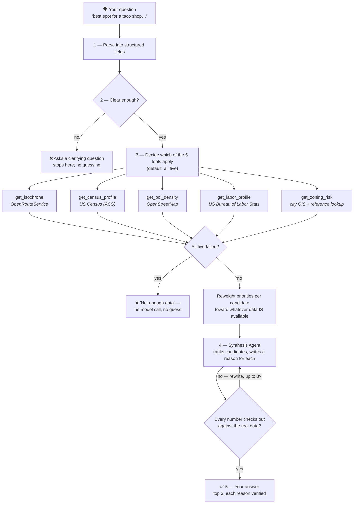

# Site Selection Copilot

You ask it something like *"best spot for a fast-casual restaurant near East Austin, budget-conscious"* — it looks up real data about a handful of candidate addresses (how easy they are to reach, who lives nearby, how many competitors are already there, what it costs to staff the place, and how risky the zoning is), then writes you a ranked top-3 with a plain-English reason for each pick. Every number in that reason is checked against the real data before you see it — if it can't be verified, it gets pulled rather than shown.

There's a web UI now (`streamlit run app.py`), and it can onboard a brand-new city on request — just tell it the name and it goes and gets the map data itself. Ask it about a city it doesn't fully know yet (say, one with no zoning data) and it adjusts its confidence honestly instead of guessing or refusing.

## How it works



Walking through it:

1. **Parse.** Your sentence becomes structured data — business type, what you care about most, any hard limits (like "needs a drive-thru"). A follow-up that only mentions new priorities still remembers the rest from your last question.
2. **Clear enough?** Before spending a single API call, it checks whether it actually understood you. Ask it to site a store selling "nostalgia and vibes" and it stops here and asks what you mean.
3. **Decide which tools apply.** All five, by default. It only skips one with a stated reason — e.g. an unstaffed vending kiosk correctly skips `get_labor_profile`, since there's no staff to price.
4. **Five tools, five real APIs.** Every box above is a live call to a public data source, not a model guessing what the data probably looks like. A failed call reports `status: failed` honestly instead of quietly returning something plausible-looking.
5. **Reweight, then synthesize.** If a candidate is missing a data point (say, this city has no zoning coverage), that slice of its priority weight doesn't just vanish — it's redistributed proportionally onto the dimensions that *do* have data for that candidate, and the model is told to score against that adjusted split. One model call then ranks the candidates and writes a reason for each.
6. **Fact-check itself.** A separate, non-negotiable check confirms every number in each reason actually appears in the source data. If it finds one that was made up, it sends it back to be rewritten (up to 3 times), and shows "manual review needed" rather than a shaky sentence if it's still not clean.

**Two exits matter as much as the happy path.** If the question doesn't make sense, it asks instead of guessing. If every data source fails, it says "not enough data" — without even calling the model — instead of ranking on nothing. Both are tested, not hypothetical.

**Real bugs this process has caught, along the way:** an automated grader's own written explanation once referenced a candidate that wasn't in the data it was given — the *score* it landed on was still right, but its self-explanation wasn't fully faithful, a good reminder to spot-check even the checker. Testing a Manhattan address surfaced that its income was being compared against *Austin's* median by default (a hardcoded leftover) — now that comparison is derived live from whichever city the address is actually in, for any US location, no hardcoding needed. And synthesis once quietly duplicated a candidate to fill out a top-3 when only two were given — it's now explicitly told never to rank more candidates than it was actually handed.

## What it's made of

Five tools, each pulling from a real, public data source. Two of them (census, labor) now work for *any* US location automatically — no per-city setup required:

| Tool | What it answers | Where the data comes from | Coverage |
|---|---|---|---|
| `get_isochrone` | "How far can someone actually drive to reach this in 10 minutes?" | OpenRouteService (self-hosted, one Docker container per onboarded city) | Any onboarded city |
| `get_census_profile` | "Who lives in that area — income, age, density?" | US Census Bureau (ACS 5-year survey) | Any US location, automatically |
| `get_poi_density` | "How many competitors are already there?" | OpenStreetMap | Anywhere in the world |
| `get_labor_profile` | "What would it cost to staff this, and is unemployment high or low here?" | Bureau of Labor Statistics | Any US location, automatically |
| `get_zoning_risk` | "Am I even allowed to open a restaurant/shop here?" | City-specific GIS layer + a small reference lookup for ambiguous zoning codes | Only cities someone has manually wired a zoning source for (currently: Austin) |

An orchestrator (built with LangGraph) decides which of these five to call for a given question, runs them, and hands everything to a synthesis step that writes the final ranked recommendation — and is not allowed to make up a number that isn't in the data it was given.

## Running it

**Web UI** (the easy way):
```bash
source .venv/bin/activate
streamlit run app.py
```
Pick a city, add a few candidate addresses, ask your question. Toggle "Show agent thinking" to see the raw data each tool returned, the reallocated weights, and the citation-checker's retry history for the query you just ran.

**Onboard a new city:**
```bash
python onboard_city.py "Dallas"
```
This downloads real map data for that city, spins up a dedicated routing container for it, and registers it — usually a few minutes, mostly spent building the routing graph. Census, labor, and competitor data need no setup at all; zoning will honestly report "no coverage" until someone wires in a real GIS source for that city (see `EXPLANATION.md`).

**Command line** (for scripting or a quick sanity check):
```bash
python chat.py          # interactive REPL
python orchestrator.py  # a scripted two-turn demo
```

You'll need three free API keys in a `.env` file — Census, BLS, and Anthropic — see `.env` for the format.

## Where things stand

- **Phase 0–1** (the five data tools + the orchestrator that ties them together): done, tested against real Austin addresses.
- **Phase 2** (does it actually work well?): done. Ran it against 8 real, recent Austin restaurant/retail openings and checked whether it would've picked the real winning spot — it did, 7 out of 8 times. Also stress-tested it against places it was never built for (Manhattan, Ithaca, Bangalore, Chennai) to make sure it fails *honestly* rather than making things up — it does.
- **Phase 3** (multi-city, a real UI, more capable agents): done. See `EXPLANATION.md` for the full detail on what each agent does and how coverage actually spreads across cities.
- **Phase 4** (fork-and-run with zero setup): not started. Today it needs Docker, three API keys, and a Python environment — getting that down to one command with no prerequisites is the next real piece of work, not just a docs update.

## Honest limitations

- **Zoning coverage is opt-in per city.** There's no general API for "give me any city's zoning map," so it stays Austin-only until someone manually wires up another city's GIS source. Everywhere else, `get_zoning_risk` reports `no_coverage` honestly, and the ranking logic reallocates that weight elsewhere instead of penalizing the candidate for it.
- **No memory of the past.** All the data is *live* — if you ask "where would this have opened in 2023," it can't rewind. It only knows today.
- **It ranks candidates you give it, not the whole city.** There's no "scan all of Austin" feature yet — you tell it which addresses to consider, and it ranks those.
- **Hard constraints are judged, not verified.** Something like "rent under $8,000/month" gets factored into the ranking by the model's judgment — none of the five tools actually return commercial rent data, so there's nothing to check that claim against.
