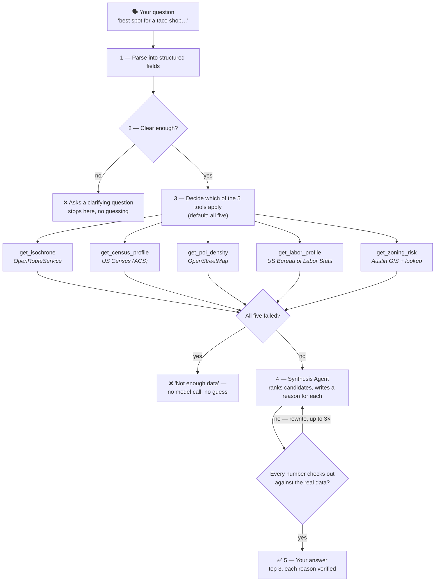

# Site Selection Copilot

You ask it something like *"best spot for a fast-casual restaurant near East Austin, budget-conscious"* — it looks up real data about a handful of candidate addresses (how easy they are to reach, who lives nearby, how many competitors are already there, what it costs to staff the place, and how risky the zoning is), then writes you a ranked top-3 with a plain-English reason for each pick. Every number in that reason is checked against the real data before you see it — if it can't be verified, it gets pulled rather than shown.

Right now it only really knows Austin, TX. Ask it about Manhattan or Bangalore and it will tell you honestly what it doesn't know, instead of guessing.

## How it works



Walking through it:

1. **Parse.** Your sentence becomes structured data — business type, what you care about most, any hard limits (like "needs a drive-thru"). A follow-up that only mentions new priorities still remembers the rest from your last question.
2. **Clear enough?** Before spending a single API call, it checks whether it actually understood you. Ask it to site a store selling "nostalgia and vibes" and it stops here and asks what you mean.
3. **Decide which tools apply.** All five, by default. It only skips one with a stated reason — e.g. an unstaffed vending kiosk correctly skips `get_labor_profile`, since there's no staff to price.
4. **Five tools, five real APIs.** Every box above is a live call to a public data source, not a model guessing what the data probably looks like. A failed call reports `status: failed` honestly instead of quietly returning something plausible-looking.
5. **Synthesis, then a fact-check on itself.** One model call ranks the candidates and writes a reason for each. A separate, non-negotiable check then confirms every number in that reason actually appears in the data — if it finds one that was made up, it sends it back to be rewritten (up to 3 times), and shows "manual review needed" rather than a shaky sentence if it's still not clean.

**Two exits matter as much as the happy path.** If the question doesn't make sense, it asks instead of guessing. If every data source fails, it says "not enough data" — without even calling the model — instead of ranking on nothing. Both are tested, not hypothetical.

**Two real bugs this process caught:** an automated grader's own written explanation once referenced a candidate that wasn't in the data it was given — the *score* it landed on was still right, but its self-explanation wasn't fully faithful, a good reminder to spot-check even the checker. Separately, testing a Manhattan address surfaced that its income was being compared against *Austin's* median by default (a hardcoded leftover) — now that comparison only happens when the system actually recognizes the city.

## What it's made of

Five small tools, each pulling from one real, public data source:

| Tool | What it answers | Where the data comes from |
|---|---|---|
| `get_isochrone` | "How far can someone actually drive to reach this in 10 minutes?" | OpenRouteService (self-hosted, Austin map data) |
| `get_census_profile` | "Who lives in that area — income, age, density?" | US Census Bureau (ACS 5-year survey) |
| `get_poi_density` | "How many competitors are already there?" | OpenStreetMap |
| `get_labor_profile` | "What would it cost to staff this, and is unemployment high or low here?" | Bureau of Labor Statistics |
| `get_zoning_risk` | "Am I even allowed to open a restaurant/shop here?" | Austin's city zoning map + a small reference lookup for tricky cases |

An orchestrator (built with LangGraph) decides which of these five to call for a given question, runs them, and hands everything to a synthesis step that writes the final ranked recommendation — and is not allowed to make up a number that isn't in the data it was given.

## Running it

```bash
docker compose up -d          # starts the local routing engine (one-time: needs the Austin map loaded first)
source .venv/bin/activate
python orchestrator.py        # runs a sample two-turn conversation
```

You'll need three free API keys in a `.env` file — Census, BLS, and Anthropic — see `.env` for the format.

## Where things stand

- **Phase 0–1** (the five data tools + the orchestrator that ties them together): done, tested against real Austin addresses.
- **Phase 2** (does it actually work well?): done. Ran it against 8 real, recent Austin restaurant/retail openings and checked whether it would've picked the real winning spot — it did, 7 out of 8 times. Also stress-tested it against places it was never built for (Manhattan, Ithaca, Bangalore, Chennai) to make sure it fails *honestly* rather than making things up — it does.
- **Phase 3** (more cities, a nicer demo, deploying it somewhere public): not started.

## Honest limitations

- **Austin only, really.** The routing engine and zoning lookup only have Austin data loaded. Census and labor data are technically nationwide, but nothing else is, so results outside Austin are mostly "I don't know."
- **No memory of the past.** All the data is *live* — if you ask "where would this have opened in 2023," it can't rewind. It only knows today.
- **It ranks candidates you give it, not the whole city.** There's no "scan all of Austin" feature yet — you tell it which addresses to consider, and it ranks those.
